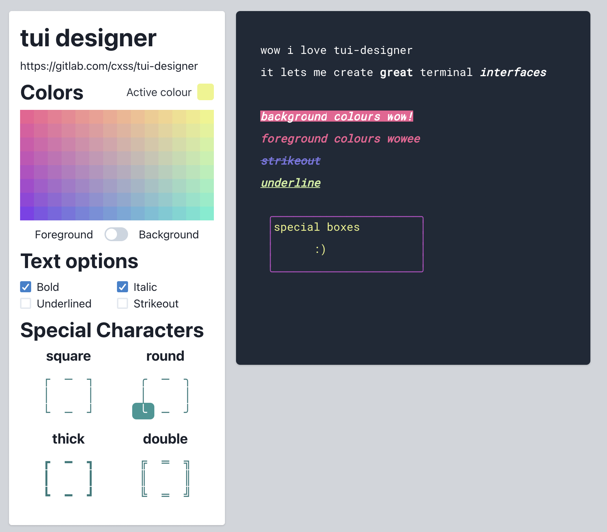

# tui-designer

quick tool for designing tui's (for [miljø](https://gitlab.com/cxss/miljo)) using nextjs, emotion, zustrand et al.

- font styling
  - bold, italic, underline, strikethrough
- color palette
- special border characters
- select area & move
